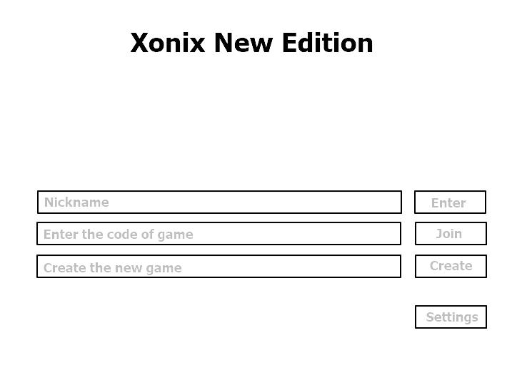

<h1>Требования к проекту “Xonix New Edition”</h1>
<h3>1 Введение</h3>
Проект направлен на разработку сетевой многопользовательской игры под названием “Xonix New Edition”. Два пользователя будут иметь возможность подключаться к общему серверу и играть в режиме реального времени. Оформление игры двухмерное.  
<h3>2 Требования пользователя</h3>
<h4>2.1 Программные интерфейсы</h4>
Разработка будет вестись с использованием языка программирования Java. Будут задействованы как стандартные библиотеки, так и сторонние, например, LibGDX. Разработка будет вестись в Intellij Idea. В Таблице 1 собраны сведения об основных программных продуктах, которые будут использоваться в процессе разработки.

Таблица 1 - Используемое в разработке стороннее ПО
Название
Oracle Java SE 11
libGDX
JetBrains IntelliJ IDEA Community Edition 
Мнемоника
Java
libGDX
IntelliJ IDEA
Версия
11.0.5
1.9.10
2019.3.5+

<h4>2.2 Интерфейс пользователя</h4>
Создаваемый программный продукт будет иметь классический графический пользовательский интерфейс. При запуске пользователю предоставлено меню, в котором он сможет ввести свой Никнейм, а также данные для локального соединения с другим игроком, а также пункт “Настройки”. Меню будет оформлено в соответствии с тематикой игры. На рисунке 1 представлен набросок меню. 

Рисунок 1 - Меню игры

После установления соединения с другим игроком пользователь включается в игровой процесс. На игровом поле будет происходить непосредственно игровой процесс (завоевание территорий игроками и т.д.), справа на информационном поле будет размещена прочая информация (например, текущий счет, текущее положение игроков, пункты управления и т.д.). На рисунке 2 представлена разметка и игрового процесса.

Рисунок 2 - Разметка игрового процесса

<h4>2.3 Характеристики пользователей</h4>
Программный продукт нацелен на рядового пользователя, обладающего компьютерными навыками и имеющим опыт в многопользовательских играх. Он должен уметь устанавливать соединение по локальной сети.
<h4>2.4 Предположения и зависимости</h4>
На перечисленные в данном документе требования к создаваемому программному продукту могут влиять сроки, отведенные для разработки, а также новые идеи.
<h3>3 Системные требования</h3>
Создаваемый программный продукт создается для работы в операционной системе Windows. Игроки должны подключиться к общей точке доступа. Для передачи данных по сети будут использоваться сокеты.
<h4>3.1 Функциональные требования</h4>
Понятный пользовательский интерфейс
Красивые текстуры и анимация
Оригинальность и хорошие игровые свойства
Наличие многопользовательского режима
(В перспективе) поддержка другими платформами
<h4>3.2 Нефункциональные требования</h4>
<h4>3.2.1 АТРИБУТЫ КАЧЕСТВА</h4>
Для создаваемого продукта необходимы такие атрибуты, как стабильность работы многопользовательского режима, невысокая требовательность к ресурсам компьютера.

