<h1>Спецификации разработки ПО</h1>
<h2>1 Введение</h2>
<h3>1.1 Цель</h3>

Данный документ содержит детали реализации требований к проекту «Xonix New Edition».

<h3>1.2 Обзор системы</h3>

Данный продукт представляет собой сетевую многопользовательскую игру. Он позволяет игроку создавать игровой сеанс, к которому может подключиться другой игрок (максимальное количество игроков - 2). Каждый из игроков может придумать и ввести свое пользовательское имя (Nickname). Игра происходит в реальном времени, игроки упрваляют мячиками и стремятся захватить определенное количество территорий за ограниченный промежуток времени. В конце игры пользователям будет предоставлена статистика завершенного игрового сеанса. Игра будет также предоставлять пользователю возможность настроек параметров сеанса и самого приложения игры. Пользователь сможет также ознакомиться с правилами игры.

<h3>1.3 Карта документа</h3>

В данном документе содержатся информациях об основных решениях, которые будут использоваться при разработке проекта. В разделе 3 содержится информация о взаимодействии программ игроков, общая информация о классах приложения, диаграмма последовательности.

<h3>1.4 Термины и сокращения</h3>

Для обозначения непосредственно игрового процесса между двумя игроками (уже после установления соединения) используется термин «Игровой сеанс».

Для удобства обозначения двух игроков будем называть того игрока, работа программы которого описывается, «игроком», а игрока, использующего удаленный компьютер – «соперником».

<h2>2 Обзор системы</h2>
<h3>2.1 Допущения</h3>

Количество игроков не будет превышать двух.

<h3>2.2 Ограничения</h3>

Ограничения, серьезно влияющие на ход разработки, отсутствуют.

<h3>2.3 Системная среда</h3>

Создаваемый программный продукт будет работать в операционной системе Windows 10.

<h3>2.4 Методология разработки</h3>

Для создания данного программного продукта была выбрана объектно-ориентированная методология разработки ПО.

Для сетевого взаимодействия используются сокеты.

<h3>2.5 Риски и опасные места</h3>

Не выявлены.

<h2>3 Архитектура</h2>
<h3>3.1 Обзор</h3>

Особенности архитектуры создаваемого приложения обусловлены объектно-ориентированной парадигмой разработки, а также тем, что данное приложение является сетевым.

<h3>3.2 Протокол сетевого взаимодействия</h3>

Для реализации многопользовательского режима создаваемой игры использованы сокеты. В качестве сетевого протокола выбран протокол TCP. Приложения на разных компьютерах используют их для обмена информацией о текущем статусе игры. 

Перед началом игрового сеанса приложение, в котором он был создан, пересылает информацию о его конфигурации приложению второго игрока примерно в следующем формате (рис. 1):

 

Рисунок 1 – Формат пересылаемого сообщения до начала игрового сеанса

Приложение второго игрока отвечает пересылкой своего никнейма (16 байт).
 

В соответствии с полученной от приложения соперника информацией, приложение игрока обновляет игровое поле и предоставляет пользователю новую информацию об игре. На рисунке 2 показан примерный формат передаваемого сообщения:
 

Рисунок 2 – Формат пересылаемого сообщения во время игрового сеанса

После получения сообщения приложение анализирует в первую очередь набор флагов. Среди основных флагов можно выделить следующие:
 
<ul>
 <li>
Флаг прерывания сеанса – соперник прервал игровой сеанс, получив такой флаг приложение игры сообщит об этом игроку и предложит вернуться в главное меню;
</li>
 <li>
Флаг паузы – соперник поставил игру на паузу, игровой сеанс приостанавливается;
</li>
 <li>
Флаг окончания игры – приложение соперника сообщило, что игра закончена.
</li>
</ul>

Возможно использование и других служебных флагов.
 

Если игра продолжается, то приложение анализирует новое положение мячика соперника (поля «Новая позиция по оси Х» и «Новая позиция по оси Y»). В соответствии с этой информацией приложение игрока отрисовывает новое расположение мячика соперника.
 

По завершении игрового сеанса программа игрока-создателя сеанса подводит итоги прошедшей партии и высылает другому игроку ее статистику примерно в следующем формате (рис. 3):
 

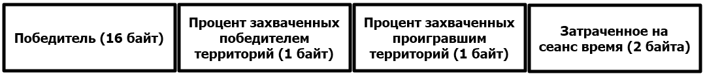

Рисунок 3 – Формат пересылаемого сообщения со статистикой игрового сеанса

Взаимодействие между программами игроков отражено на диаграмме последовательности (рис. 4).
 

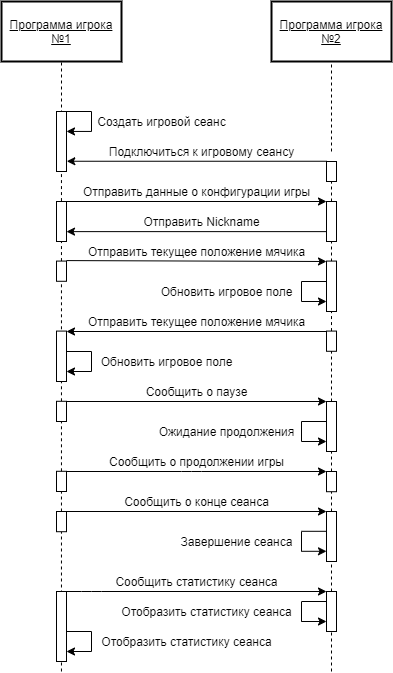

Рисунок 4 – Диаграмма последовательности игры «Xonix New Edition»

<h3>3.3 Классы</h3>

В соответствии с парадигмой объектно-ориентированного программирования за каждую важную деталь создаваемой игры отвечает отдельный класс. К основным классам можно отнести:

<ul>
 <li>
MyBall – отвечает за мячик игрока;
</li>
 <li>
EnemyBall – отвечает за мячик соперника;
</li>
 <li>
Background – отвечает за фон;
</li>
 <li>
SocketCommunication – отвечает за сетевое взаимодействие;
</li>
 <li>
MainWindow – отвечает за главное меню;
</li>
 <li>
SettingsWindow – отвечает за меню настроек;
</li>
 <li>
SessionConfigurationWindow – отвечает за окно создания игрового сеанса;
</li>
 <li>
GameResultsWindow – отвечает за окно, отображающее результаты игрового сеанса;
</li>
 <li>
MessageWindow – отвечает за различные уведомления (такие как пауза, прерывание игры);
</li>
 <li>
XonixGame – основной игровой класс;
</li>
 <li>
DesktopLauncher – класс, отвечающий за запуск приложения на десктопе;
</li>
 <li>
GameWindow – отвечает за игровое поле.
</li>
</ul>
<h3>3.4 Диаграмма вариантов использования и интерфейс пользователя</h3>

На рисунке 5 изображена диаграмма вариантов использования создаваемой многопользовательской игры.

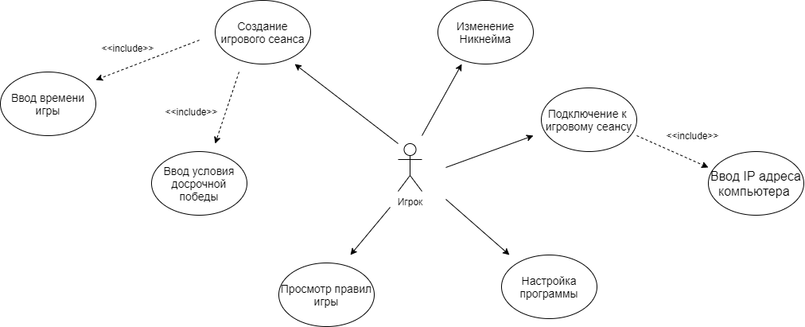

Рисунок 5 – Диаграмма вариантов использования игры «Xonix New Edition»</h2>

Создаваемый программный продукт будет иметь классический графический пользовательский интерфейс. При запуске пользователю предоставлено меню, в котором он сможет ввести свой Никнейм, данные для локального соединения с другим игроком, а также сможет выбрать пункт “Настройки” или “Помощь”. Игрок может также создать игровой сеанс сам. В пункте "Помощь" пользователь может получить информацию о правилах игры и как установить соединение с соперником. Имеется пункт "Настройки" для конфигурирования приложения. Оформление меню и самой игры минималистичное, на фоне допускаются картинки, соответсвующие общему оформлению игры. На рисунке 6 представлен набросок меню.

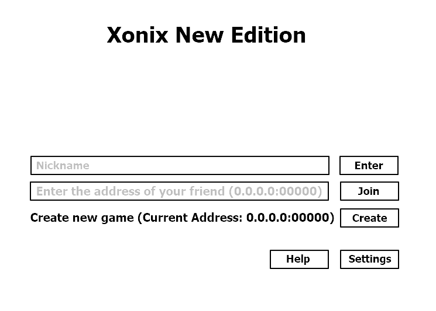

Рисунок 6 - Меню игры

Компьютеры соперников должны быть подключены к общей локальной сети (общий Wi-fi или точка доступа). Перед началом игрового процесса игрок, создающий игру, может выбрать ее длительность и количество захваченных территорий, необходимых для досрочного выигрыша. Предложен выход в главное меню. Далее игрок ожидает подключения своего соперника. Если соперник пытается подключиться к игре, он должен ввести IP адрес компьютера, на котором была создана игра (это значение будет указано на главном меню). Если она не была создана, то ему будет выведено соответствующее сообщение и будет предложен возврат в главное меню.(рис. 7)

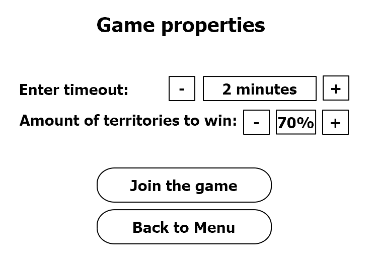

 

Рисунок 7 - Настройка партии

После установления соединения со свои соперником игрок включается в игровой процесс. На игровом поле будет происходить непосредственно игровой процесс (завоевание территорий игроками и т.д.), справа на информационном поле будет размещена прочая информация (например, текущие достижения игроков, кнопки выхода в главное меню и паузы и т.д.). Игроки управляют мячиками, отрезая тем самым себе территории. В начале игры мячики находятся в противоположных углах игрового поля. Создатель игрового сеанса управляет синим мячиком, его соперник - красным. Управление осуществляется стрелками клавиатуры, по диагонали мячики двигаться не могут. Игроки также мешают друг другу отрезать территории, пересекая след соперника (след существует до тех пор, пока территория не отрезана полностью.) При пересечении следа тот начинает постепенно пропадать, пока не достигнет мячика (исчезновение следа начинается в месте пересечения). Если мячик успел достигнуть отрезанной территории или края игрового поля, то след восстанавливается и мячик успешно отрезает территорию. Если два пользователя пересекают следы друг друга одновременно, то в проигрыше окажется тот игрок, чей след был пересечен ближе к его мячику. В результате след пропадает, и игрок вынужден начинать процесс отрезания территории заново. Для этого он должен попасть на отрезанную территорию и двигаться по "пустым" (неотрезанным) территориям. На рисунке 8 представлена разметка и игрового процесса.

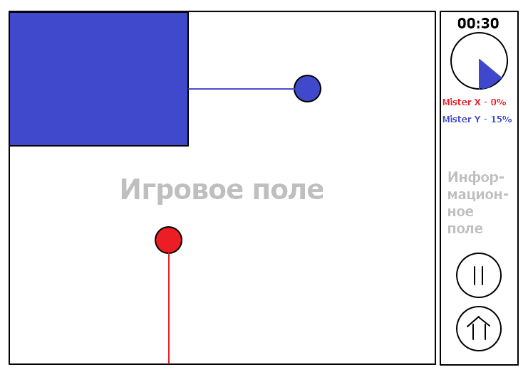

 

Рисунок 8 - Разметка игрового процесса

Во время игры игрок может захотеть поставить игру на паузу. Для этого он длжен нажать соответствующую кнопку на экране (см. рис. 8). После этого он увидит следующее окно (рис. 9)
 

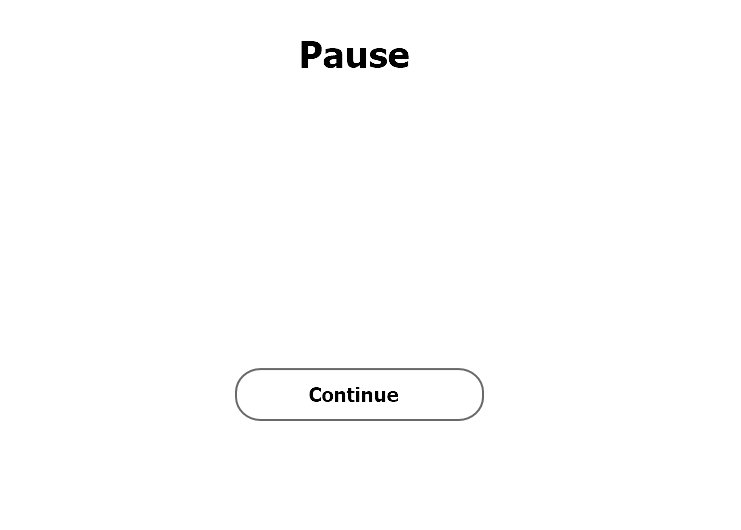

Рисунок 9 - Окно паузы

Его соперник будет ожидать окончания паузы, а может покинуть игровой сеанс. (рис. 10)
 

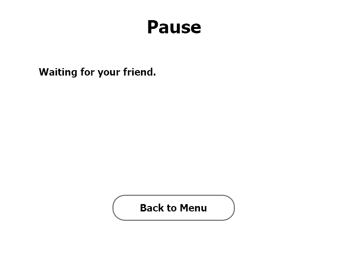

Рисунок 10 - Окно паузы соперника

В конце игры игроку будет предоставлена статистика о завершенном сеансе. В ней будет содержаться информация о количестве захваченных территорий, о затраченном на сеанс времени и т.д. Будет предложен выход в главное меню.(рис. 11)
 

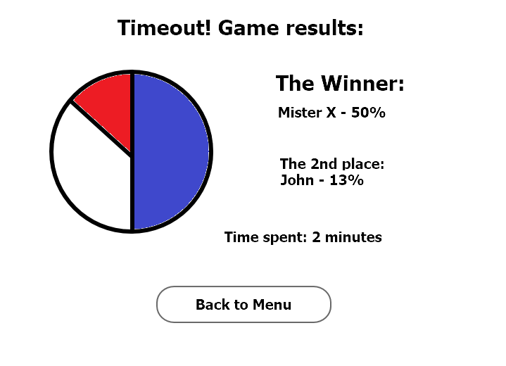

Рисунок 11 - Статистика сеанса

Окно справки будет представлять собой текстовое поле с прокруткой, в котором будут содержаться правила игры и инструкция по подключению. (рис. 12)

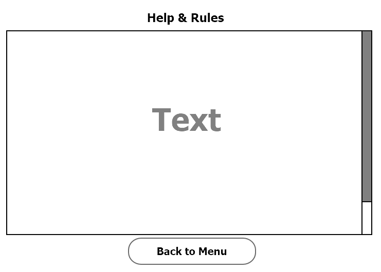

Рисунок 12 - Окно справки

Окно настроек будет содержать те пункты, которые окажутся необходимы в процессе разработки. Если таких пунктов не будет, то пункт настроек можно убрать из главного меню. (рис. 13)

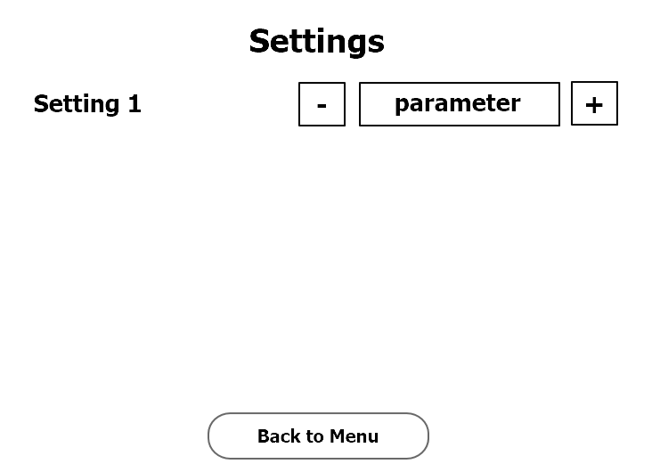

Рисунок 13 - Окно настроек

В процессе работы программы возможно появление различных информационных сообщений (например, ожидание соперника). Формат такого сообщения приведен на рисунке 14.

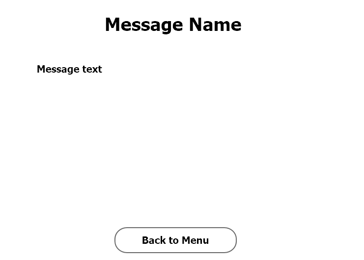

Рисунок 14 - Окно сообщения

