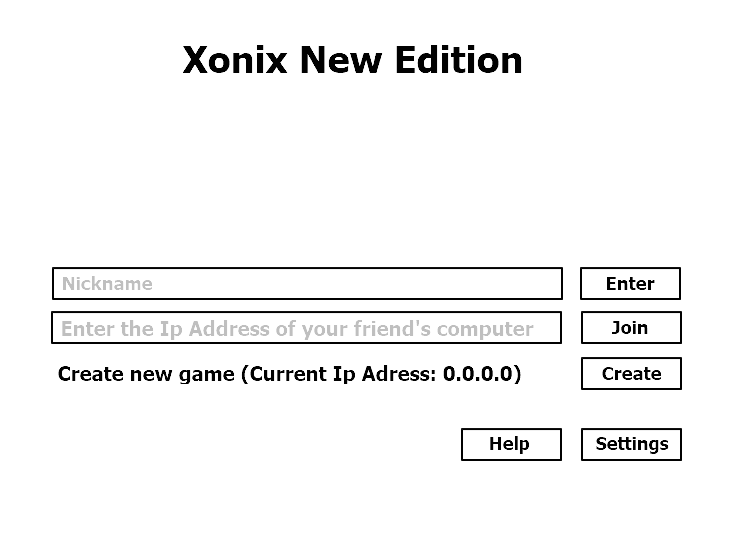
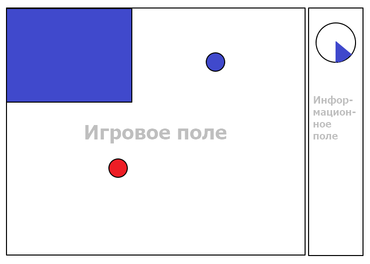

<h1>Спецификации разработки ПО</h1>
<h2>1 Введение</h2>
<h3>1.1 Цель</h3>

Данный документ содержит детали реализации требований к проекту «Xonix New Edition».

<h3>1.2 Обзор системы</h3>

Данный продукт представляет собой сетевую многопользовательскую игру. Он позволяет игроку создавать игровой сеанс, к которому может подключиться другой игрок (максимальное количество игроков - 2). Каждый из игроков может придумать и ввести свое пользовательское имя (Nickname). Игра происходит в реальном времени, игроки стремятся захватить определенное количество территорий за ограниченный промежуток времени. В конце игры пользователям будет предоставлена статистика завершенного игрового сеанса. Игра будет также предоставлять пользователю возможность настроек параметров сеанса и самого приложения игры. Пользователь сможет также ознакомиться с правилами игры.

<h3>1.3 Карта документа</h3>

В данном документе содержатся информациях об основных решениях, которые будут использоваться при разработке проекта. В разделе 3 содержится информация о взаимодействии программ игроков, общая информация о классах приложения, диаграмма последовательности.

<h3>1.4 Термины и сокращения</h3>

Для обозначения непосредственно игрового процесса между двумя игроками (уже после установления соединения) используется термин «Игровой сеанс».

Для удобства обозначения двух игроков будем называть того игрока, работа программы которого описывается, «игроком», а игрока, использующего удаленный компьютер – «соперником».

<h2>2 Обзор системы</h2>
<h3>2.1 Допущения</h3>

Количество игроков не будет превышать двух.

<h3>2.2 Ограничения</h3>

Ограничения, серьезно влияющие на ход разработки, отсутствуют.

<h3>2.3 Системная среда</h3>

Создаваемый программный продукт будет работать в операционной системе Windows 10.

<h3>2.4 Методология разработки</h3>

Для создания данного программного продукта была выбрана объектно-ориентированная методология разработки ПО.

Для сетевого взаимодействия используются сокеты.

<h3>2.5 Риски и опасные места</h3>

Не выявлены.

<h2>3 Архитектура</h2>
<h3>3.1 Обзор</h3>

Особенности архитектуры создаваемого приложения обусловлены объектно-ориентированной парадигмой разработки, а также тем, что данное приложение является сетевым.

<h3>3.2 Протокол сетевого взаимодействия</h3>

Для реализации многопользовательского режима создаваемой игры использованы сокеты. В качестве сетевого протокола выбран протокол TCP. Приложения на разных компьютерах используют их для обмена информацией о текущем статусе игры. 

Перед началом игрового сеанса приложение, в котором он был создан, пересылает информацию о его конфигурации приложению второго игрока примерно в следующем формате (рис. 1):

 

Рисунок 1 – Формат пересылаемого сообщения до начала игрового сеанса

Приложение второго игрока отвечает пересылкой своего никнейма (16 байт).
 

В соответствии с полученной от приложения соперника информацией, приложение игрока обновляет игровое поле и предоставляет пользователю новую информацию об игре. На рисунке 2 показан примерный формат передаваемого сообщения:
 

Рисунок 2 – Формат пересылаемого сообщения во время игрового сеанса

После получения сообщения приложение анализирует в первую очередь набор флагов. Среди основных флагов можно выделить следующие:
 
<ul>
 <li>
Флаг прерывания сеанса – соперник прервал игровой сеанс, получив такой флаг приложение игры сообщит об этом игроку и предложит вернуться в главное меню;
</li>
 <li>
Флаг паузы – соперник поставил игру на паузу, игровой сеанс приостанавливается;
</li>
 <li>
Флаг окончания игры – приложение соперника сообщило, что игра закончена.
</li>
</ul>

Возможно использование и других служебных флагов.
 

Если игра продолжается, то приложение анализирует новое положение мячика соперника (поля «Новая позиция по оси Х» и «Новая позиция по оси Y»). В соответствии с этой информацией приложение игрока отрисовывает новое расположение мячика соперника.
 

По завершении игрового сеанса программа игрока-создателя сеанса подводит итоги прошедшей партии и высылает другому игроку ее статистику примерно в следующем формате (рис. 3):
 

Рисунок 3 – Формат пересылаемого сообщения со статистикой игрового сеанса

<h3>3.3 Классы</h3>

В соответствии с парадигмой объектно-ориентированного программирования за каждую важную деталь создаваемой игры отвечает отдельный класс. К основным классам можно отнести:

<ul>
 <li>
MyBall – отвечает за мячик игрока;
</li>
 <li>
EnemyBall – отвечает за мячик соперника;
</li>
 <li>
Background – отвечает за фон;
</li>
 <li>
SocketCommunication – отвечает за сетевое взаимодействие;
</li>
 <li>
MainWindow – отвечает за главное меню;
</li>
 <li>
SettingsWindow – отвечает за меню настроек;
</li>
 <li>
SessionConfigurationWindow – отвечает за окно создания игрового сеанса;
</li>
 <li>
GameResultsWindow – отвечает за окно, отображающее результаты игрового сеанса;
</li>
 <li>
MessageWindow – отвечает за различные уведомления (такие как пауза, прерывание игры);
</li>
 <li>
XonixGame – основной игровой класс;
</li>
 <li>
DesktopLauncher – класс, отвечающий за запуск приложения на десктопе;
</li>
 <li>
GameWindow – отвечает за игровое поле.
</li>
</ul>
<h3>3.4 Диаграмма вариантов использования и интерфейс пользователя</h3>

На Рисунке 4 изображена диаграмма вариантов использования создаваемой многопользовательской игры.

Рисунок 4 – Диаграмма вариантов использования игры «Xonix New Edition»</h2>

Создаваемый программный продукт будет иметь классический графический пользовательский интерфейс. При запуске пользователю предоставлено меню, в котором он сможет ввести свой Никнейм, данные для локального соединения с другим игроком, а также сможет выбрать пункт “Настройки” или “Помощь”. В пункте "Помощь" пользователь может получить информацию о правилах игры и как установить соединение с соперником. Оформление меню и самой игры минималистичное, на фоне допускаются картинки, соответсвующие общему оформлению игры. На рисунке 5 представлен набросок меню.

Рисунок 5 - Меню игры

Компьютеры соперников должны быть подключены к общей локальной сети (общий Wi-fi или точка доступа). Перед началом игрового процесса пользователь, создающий игру, может выбрать ее длительность и количество захваченных территорий, необходимых для досрочного выигрыша. Предложен выход в главное меню. Если игрок пытается подключиться к игре он должен ввести IP адрес компьютера, на котором была создана игра (это значение будет указано на главном меню). Если она не была создана, то ему будет выведено соответствующее сообщение и будет предложен возврат в главное меню.(рис. 6)

 

Рисунок 6 - Настройка партии

После установления соединения с другим игроком пользователь включается в игровой процесс. На игровом поле будет происходить непосредственно игровой процесс (завоевание территорий игроками и т.д.), справа на информационном поле будет размещена прочая информация (например, текущие достижения игроков, кнопки выхода в главное меню и паузы и т.д.). На рисунке 7 представлена разметка и игрового процесса.

 

Рисунок 7 - Разметка игрового процесса

В конце игры пользователю будет предоставлена статистика о завершенном сеансе. В ней будет содержаться информация о количестве захваченных территорий, о затраченном на сеанс времени и т.д. Будет предложен выход в главное меню.(рис. 8)
 

Рисунок 8 - Статистика сеанса

