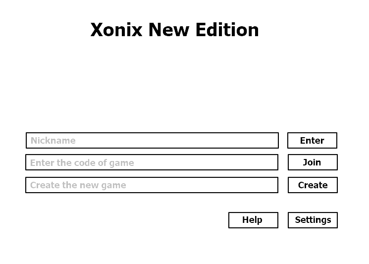

<h1>Требования к проекту “Xonix New Edition”</h1>
<h2>1 Введение</h2>

Проект направлен на разработку сетевой многопользовательской игры под названием “Xonix New Edition”. Два пользователя будут иметь возможность подключаться к общей игре и играть в режиме реального времени. Оформление игры двухмерное. Тематика игры напоминает классическую игру "Xonix".

<h2>2 Требования пользователя</h2>
<h3>2.1 Программные интерфейсы</h3>

Разработка будет вестись с использованием языка программирования Java. Будут задействованы как стандартные библиотеки, так и сторонние, например, LibGDX. Разработка будет вестись в Intellij Idea. В Таблице 1 собраны сведения об основных программных продуктах, которые будут использоваться в процессе разработки.

Таблица 1 - Используемое в разработке стороннее ПО
<table align="center">
  <tr>
    <td>Название</td>
    <td>Oracle Java SE Development Kit 11</td>
    <td>libGDX</td>
    <td>JetBrains IntelliJ IDEA Community Edition </td>
  </tr>
    <tr>
    <td>Мнемоника</td>
    <td>Java</td>
    <td>libGDX</td>
    <td>IntelliJ IDEA</td>
  </tr>
    <tr>
    <td>Версия</td>
    <td>11.0.5</td>
    <td>1.9.10</td>
    <td>2019.3.5+</td>
  </tr>
</table>
<h3>2.2 Интерфейс пользователя</h3>

Создаваемый программный продукт будет иметь классический графический пользовательский интерфейс. При запуске пользователю предоставлено меню, в котором он сможет ввести свой Никнейм, данные для локального соединения с другим игроком, а также сможет выбрать пункт “Настройки” или “Помощь”. В пункте "Помощь" пользователь может получить информацию о правилах игры и как установить соединение с соперником. Оформление меню и самой игры минималистичное, на фоне допускаются картинки, соответсвующие общему оформлению игры. На рисунке 1 представлен набросок меню.

Рисунок 1 - Меню игры

Перед началом игрового процесса пользователь, создающий игру, может выбрать ее длительность и количество захваченных территорий, необходимых для досрочного выигрыша. (рис. 3)

 

Рисунок 2 - Настройка партии

После установления соединения с другим игроком пользователь включается в игровой процесс. На игровом поле будет происходить непосредственно игровой процесс (завоевание территорий игроками и т.д.), справа на информационном поле будет размещена прочая информация (например, текущие достижения игроков, кнопка выхода в главное меню и т.д.). На рисунке 2 представлена разметка и игрового процесса.

 

Рисунок 3 - Разметка игрового процесса

В конце игры пользователю будет предоставлена статистика о завершенном сеансе. В ней будет содержаться информация о количестве захваченных территорий, о затраченном на сеанс времени и т.д. (рис. 4)
 

Рисунок 4 - Статистика сеанса

<h3>2.3 Характеристики пользователей</h3>

Программный продукт нацелен на рядового пользователя, обладающего стандарными компьютерными навыками и имеющим опыт в многопользовательских играх. Он должен уметь устанавливать соединение по локальной сети.

<h3>2.4 Предположения и зависимости</h3>

На перечисленные в данном документе требования к создаваемому программному продукту могут влиять сроки, отведенные для разработки, а также новые идеи.

<h2>3 Системные требования</h2>
<h3>3.1 Функциональные требования</h3>
<ul>
 <li>
Качественное оформление приложения, включающее в себя понятный пользовательский интерфейс, красивые текстуры и анимацию;
</li>
 <li>
Возможность ввода пользовательского имени (Nickname) с проверкой на корректность ввода;
</li>
 <li>
Наличие многопользовательского режима, с возможностью как создать собственный игровой сеанс, так и подключиться к существующему. Игрок, создавший и настроивший сеанс, ждет подключения своего соперника;
</li>
 <li>
После установки соединения между компьютерами игроков начинается непосредственно игровой процесс. Игроки стремятся отрезать себе наибольший кусок территорий, мешая друг другу подобно тому, как вражеские точки (или мячики) мешают игроку захватить территории в оригинальной игре "Xonix". На игровом поле будут находится различные бонусы/антибонусы. Будет происходить счет времени и захваченных территорий. Победителем будет признан тот игрок, который захватил определенное количество территорий или захватил больше территорий за ограниченный промежуток времени. По окончании игры пользователям будет предоставлена статистика прошедшей партии, содержащая данные о времени, количестве набранных очков, количестве захваченных территорий. Будет предложен выход в главное меню.
</li>
 <li>
Адекватная реакция приложения на различные ненормальные ситуации, такие как потеря сетевого подключения, различные сбои в работе приложения;
</li>
 <li>
(В перспективе) поддержка другими платформами (напр., Android).
</li>
</ul>
<h3>3.2 Нефункциональные требования</h3>
<h4>3.2.1 Атрибуты качества</h4>

Для создаваемого продукта необходимы такие атрибуты, как стабильность работы многопользовательского режима, невысокая требовательность к ресурсам компьютера. Это должно обеспечить приятный игровой процесс, не сопровождающийся перегревом компьютера и сбоями в игре. Приложение не будет требовать никаких личных данных пользователя во избежание несанкционированного доступа к ним.

